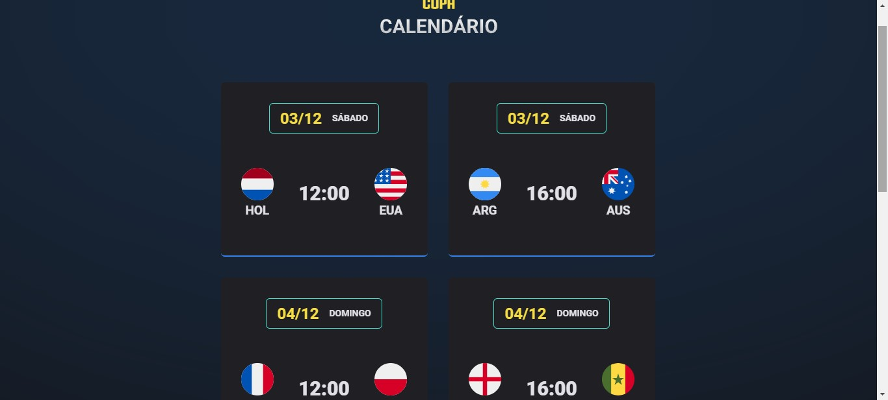

<h1 align="center"> World Cup 2022 </h1>

Calendário com datas e horários da Copa do Mundo 2022.

  <a href="#-tecnologias">Tecnologias</a>&nbsp;&nbsp;&nbsp;|&nbsp;&nbsp;&nbsp;
  <a href="#-projeto">Projeto</a>&nbsp;&nbsp;&nbsp;|&nbsp;&nbsp;&nbsp;
  <a href="#-layout">Layout</a>&nbsp;&nbsp;&nbsp;|&nbsp;&nbsp;&nbsp;
  <a href="#memo-licença">Licença</a>

  

 

  

## 🚀 Tecnologias

Esse projeto foi desenvolvido com as seguintes tecnologias:

- HTML e CSS
- JavaScript
- Git e GitHub

## 💻 Projeto

O Projeto foi desenvolvido para você que está procurando saber os horários e datas dos jogos da Copa, então não perca. Salve, compartilhe e aproveite cada jogo torcendo por sua Seleção.

## 🔖 Layout

Você pode visualizar o layout do projeto através [DESSE LINK]().

## :memo: Licença

Esse projeto está sob a licença MIT.

---

Feito com ♥.